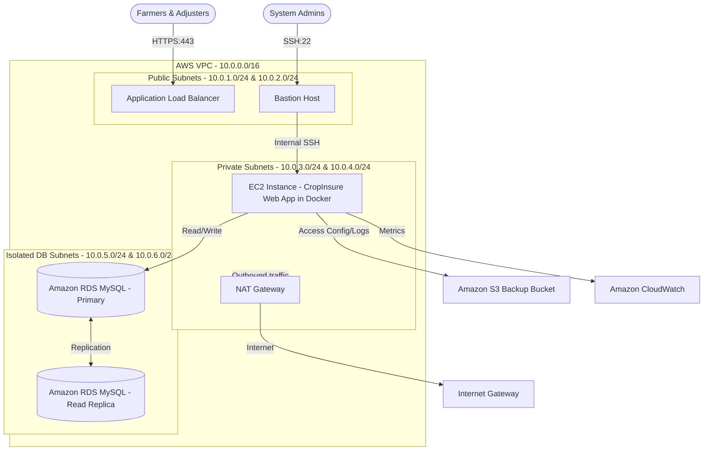

# AWS Cloud Architecture Design - CropInsure Agricultural Insurance Cloud

This document outlines the enterprise cloud architecture designed for the CropInsure platform, ensuring high availability, network isolation, fault tolerance, and security compliance.

---

## 1. Network Topology (AWS VPC Design)
The network structure isolates services inside a dedicated VPC using multi-AZ (Availability Zone) placement for disaster recovery.

### Subnet Layout
- **CIDR Block**: `10.0.0.0/16`
- **Public Subnet A (`10.0.1.0/24`)**: Houses the Application Load Balancer (ALB) and public-facing Bastion host.
- **Public Subnet B (`10.0.2.0/24`)**: Secondary public subnet for ALB multi-AZ high availability.
- **Private Subnet A (`10.0.3.0/24`)**: Houses the primary EC2 Instance running the Dockerized Node web service.
- **Private Subnet B (`10.0.4.0/24`)**: Standby subnet for EC2 Auto Scaling group failover.
- **Data Subnet A (`10.0.5.0/24`)**: Houses the primary RDS MySQL database instance.
- **Data Subnet B (`10.0.6.0/24`)**: Houses the RDS Read-Replica database for reporting and high-availability read access.

---

## 2. Infrastructure Security (Security Groups)

Three separate Security Groups govern internal communication:

### Load Balancer Security Group (`sg-cropinsure-alb`)
- **Inbound Rules**:
  - `HTTP (80)` from `0.0.0.0/0` (Redirected to HTTPS)
  - `HTTPS (443)` from `0.0.0.0/0` (End-user dashboard access)
- **Outbound Rules**:
  - `HTTP/HTTPS (3694)` to `sg-cropinsure-app` (Forwarding to backend container)

### Application Host Security Group (`sg-cropinsure-app`)
- **Inbound Rules**:
  - `TCP (3694)` from `sg-cropinsure-alb` (Application web traffic)
  - `SSH (22)` from `sg-cropinsure-bastion` (Secure terminal operations)
- **Outbound Rules**:
  - `MySQL (3306)` to `sg-cropinsure-db` (Database queries)
  - `HTTPS (443)` to `0.0.0.0/0` (Sending CloudWatch metrics & S3 backup transfers)

### Database Security Group (`sg-cropinsure-db`)
- **Inbound Rules**:
  - `MySQL (3306)` from `sg-cropinsure-app` (Restricted query access)
- **Outbound Rules**:
  - None (Fully isolated block)

---

## 3. Storage & Disaster Recovery (S3 & RDS Backups)
- **Amazon S3 (`s3://cropinsure-backups-us-east-1`)**: Used to store daily MySQL database dumps. Objects are configured with a lifecycle rule:
  - Transit backups to **S3 Standard** upon creation.
  - Automatically transition backups to **S3 Glacier Flexible Retrieval** after 30 days.
  - Permanently delete archive data after 1 year (compliance requirement).
- **RDS Backups**: Automatic snapshotting enabled with a 7-day retention period.

---

## 4. Identity & Access Management (IAM Policies)
The system enforces the Principle of Least Privilege:

### App Instance IAM Role
Granted to the EC2 host via an Instance Profile.
- **AWS S3 Access**: Allow `PutObject`, `ListBucket` to `s3://cropinsure-backups-us-east-1` (to upload backup dumps).
- **AWS CloudWatch Access**: Allow `PutMetricData` (to stream custom application CPU/memory alarms).

### SysAdmin Group Policy
- Full access to EC2, RDS, S3, and VPC configurations.
- Require Multi-Factor Authentication (MFA) to perform any critical resource deletions.
