# AWS Pricing Strategy & Infrastructure Cost Estimates

This document provides detailed estimates for the CropInsure Agricultural Insurance Cloud setup, detailing standard, high-availability, and disaster recovery tiers, along with TCO (Total Cost of Ownership) optimizations.

---

## 1. Core Services Price Breakdown

All estimates are based on current **AWS US-East-1 (N. Virginia)** region pricing.

### A. Compute Instances (EC2)
EC2 instances run our dockerized Express web server inside a private subnet.

| Service Tier | Instance Type | Specifications | Cost per Hour | Estimated Monthly Cost (per instance) |
| :--- | :--- | :--- | :--- | :--- |
| **Development / Test** | `t3.medium` | 2 vCPUs, 4 GiB RAM | ₹3.45 | **₹2,520** |
| **Small Production** | `m5.large` | 2 vCPUs, 8 GiB RAM | ₹7.96 | **₹5,810** |
| **High Performance** | `c5.2xlarge` | 8 vCPUs, 16 GiB RAM | ₹28.22 | **₹20,600** |

### B. Database (Amazon RDS MySQL)
Amazon RDS handles customer profiles, crop policies, audit logs, and metrics.

- **Primary DB Instance (`db.m5.large` - Single-AZ)**: ₹14.77 per hour = **₹10,790 / month**.
- **High Availability DB (`db.m5.large` - Multi-AZ)**: ₹29.54 per hour = **₹21,580 / month**.
- **Backup Storage**: ₹7.90 per GB per month (7-day automated snapshot retention included free up to DB size).

### C. S3 Storage & Archiving
S3 holds database backups (`.sql.gz`) and historical satellite crop data.

- **S3 Standard**: ₹1.90 per GB-month (first 50 TB).
- **S3 Glacier Flexible Retrieval**: ₹0.30 per GB-month.
- **S3 Glacier Deep Archive**: ₹0.08 per GB-month.
- *Estimated Storage Cost (1,000 GB Standard + 5,000 GB Glacier)*: ₹1,900 + ₹1,500 = **₹3,400 / month**.

### D. Data Transfer & Networking
- **Application Load Balancer (ALB)**: ₹1.86 per LCU-hour = **₹1,850 / month**.
- **NAT Gateway (1 Gateway)**: ₹3.73 per hour + ₹3.73 per GB processed = **₹2,720 / month** (plus ~ ₹1,240 traffic fee).
- **Data Transfer Out (to Internet)**: First 100 GB free. ₹7.47 per GB after. Estimated ~ 300 GB = **₹1,490 / month**.

---

## 2. Redundancy & Disaster Recovery (DR) Tiers

Pricing varies significantly based on RPO (Recovery Point Objective) and RTO (Recovery Time Objective) targets.

```mermaid
gantt
    title Disaster Recovery SLA Tiers
    dateFormat  X
    axisFormat %s
    
    section Bronze DR
    RPO (24 Hours) : active, 0, 24
    RTO (48 Hours) : active, 0, 48
    
    section Silver DR
    RPO (1 Hour) : active, 0, 1
    RTO (4 Hours) : active, 0, 4
    
    section Gold DR
    RPO (Real-time) : active, 0, 0.01
    RTO (Real-time) : active, 0, 0.05
```

### Bronze Tier (Dev/Test)
- **Strategy**: Daily database backups to S3, manual script-based rebuilds.
- **RPO**: 24 Hours | **RTO**: 48 Hours
- **Extra Cost**: None (relies on S3 logs).
- **Total Infrastructure Cost**: **₹16,180 / month** (t3.medium + Single-AZ RDS + S3).

### Silver Tier (Production - Multi-AZ Deployment)
- **Strategy**: Multi-AZ RDS replication, auto-scaling EC2 web hosts across 2 Availability Zones, automated 1-hour DB snapshots.
- **RPO**: 1 Hour | **RTO**: 4 Hours
- **Extra Cost**: ALB + NAT Gateway + Multi-AZ RDS.
- **Total Infrastructure Cost**: **₹43,990 / month** (m5.large Multi-AZ + 2 EC2 instances + ALB + S3).

### Gold Tier (Enterprise - Multi-Region Deployment)
- **Strategy**: Active-Passive setup across 2 AWS Regions (e.g., US-East-1 and US-West-2). RDS Global Databases (real-time sync), Route 53 DNS Failover.
- **RPO**: < 10 seconds | **RTO**: < 5 minutes
- **Extra Cost**: Double compute cost, RDS Global DB replication, cross-region S3 copy.
- **Total Infrastructure Cost**: **₹97,940 / month** (Double production stack + Global DB sync + Route 53 failover).

---

## 3. Cost Optimization Recommendations (TCO Reductions)

To optimize AWS expenditures, the CropInsure platform recommends:

1. **AWS Instance Savings Plans**: Commit to a 1-year or 3-year term for EC2 instances to save up to **30-40%** compared to On-Demand billing.
2. **S3 Intelligent-Tiering**: Automate transit between Standard and Infrequent Access tiers to reduce S3 storage fees by ~**25%** for older data.
3. **Database Right-Sizing**: Start dev workloads on `db.t3.medium` instances and scale to `db.m5.large` as active farmer records expand.
4. **Schedule Non-Production Environments**: Automate shut down of t3.medium test environments on weekends and after-hours (using AWS Instance Scheduler) to save **30%** on development compute costs.
