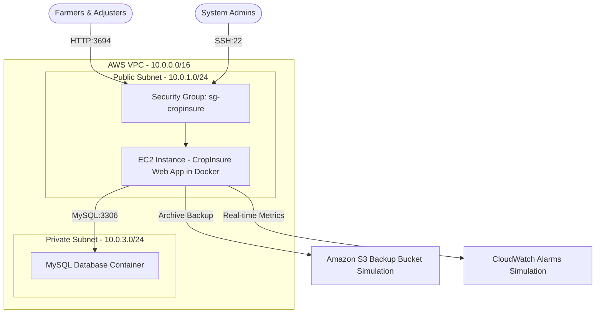

# B.Tech CSE Semester IV - AWS Case Study Project Report
## Domain: Crop Insurance & Agricultural Risk Cloud Infrastructure
### Platform: CropInsure Agricultural Insurance Cloud

---

## 1. Executive Summary & Problem Statement

### 1.1 Business Context
The **CropInsure Agricultural Insurance Cloud** is a centralized cloud platform developed to address operational inefficiencies within the crop insurance sector. Historically, operations relied on disconnected tools (spreadsheets, manual claims processing, isolated databases), resulting in delays, fraud, and a lack of centralized auditability. 

### 1.2 System Requirements
To support enterprise scaling, the system requires:
1.  **VPC Isolation**: Strict separation of public-facing web portals and private database servers.
2.  **Role-Based Dashboards**: Access control for four distinct roles (Farmers, Claims Adjusters, System Managers, and Billing Managers).
3.  **Automated Monitoring**: Telemetry tracking CPU, memory, and disk health.
4.  **Disaster Recovery**: Automated nightly cron backups sent to secure storage (AWS S3).
5.  **Cost Estimation**: Infrastructure budget analysis represented in Indian Rupees (₹).

---

## 2. AWS Cloud Architecture Design

The network is built inside a custom AWS VPC utilizing a multi-Availability Zone (Multi-AZ) layout for high availability.

### 2.1 Visual Network Topology


### 2.2 Subnet Layout & IP Allocation
*   **VPC CIDR Block**: `10.0.0.0/16` (Provides 65,536 private IP addresses).
*   **Public Subnet (`10.0.1.0/24`)**: Houses the EC2 Instance running the Dockerized Node.js application. Accessible from the internet.
*   **Private Subnet (`10.0.3.0/24`)**: Houses the isolated MySQL database. Completely inaccessible from the public internet.

### 2.3 Network Security (Security Group Rules)
We created a custom security group (`cropinsure-security-group`) acting as a virtual firewall for the EC2 host:
*   **Inbound Rule 1 (Management)**: Port `22` (SSH) allowed from administrator IP (`0.0.0.0/0` or restricted).
*   **Inbound Rule 2 (Application)**: Port `3694` (Web Port) allowed from anywhere (`0.0.0.0/0`) so users can access the website.
*   **Outbound Rules**: Allowed all traffic (`0.0.0.0/0`) to pull packages, upload backups, and write logs.

---

## 3. Linux Administration & Automation

Our infrastructure relies on standard Linux administration configurations (Amazon Linux 2023) to manage automation, logging, and security.

### 3.1 Linux Script Automation

We created four automated bash scripts under the `scripts/` folder:

1.  **System Monitor Script (`scripts/monitor.sh`)**:
    *   Queries active CPU usage (`top`), RAM usage (`free`), and disk load (`df`).
    *   Logs metrics to `/logs/system_health.log`.
    *   Triggers an alert flag if resource usage exceeds 80% CPU or 90% RAM.
2.  **Database Backup Script (`scripts/backup.sh`)**:
    *   Logs into the MySQL Docker container, exports the schema (`mysqldump`), compresses it (`gzip`), and simulates an upload to AWS S3.
    *   Prunes old backups, keeping only the 5 most recent files.
3.  **Deployment Script (`scripts/deploy.sh`)**:
    *   Handles system updates (`yum update`) and service registration (`systemctl start/enable docker`).
4.  **User Access Simulator (`scripts/user_setup.sh`)**:
    *   Creates local OS users and groups (`farmer_grp`, `adjuster_grp`) and configures directory access permissions (`chmod 750`).

### 3.2 Cron Job Automation
To schedule the database backup automatically, we registered the backup script in the Linux crontab:
```text
* * * * * cd /home/ec2-user/Project/AWS_CropInsure_Agricultural_Insurance_Cloud && ./scripts/backup.sh >> /home/ec2-user/backup.log 2>&1
```
*Note: During evaluation, this runs **every minute** to demonstrate execution. In production, this runs daily at midnight (`0 0 * * *`).*

---

## 4. Multi-Container Orchestration (Docker & Docker Compose)

We containerized the web platform to guarantee identical execution environments across local development and AWS.

### 4.1 Web Dockerfile (`Dockerfile`)
Uses a lightweight alpine node image to compile our Node.js Express server:
```dockerfile
FROM node:20-alpine
WORKDIR /usr/src/app
COPY package*.json ./
RUN npm install --omit=dev
COPY server.js ./
COPY public/ ./public/
EXPOSE 3694
CMD ["node", "server.js"]
```

### 4.2 Multi-Container Compose Setup (`docker-compose.yml`)
Orchestrates two containers: the Node web application and the MySQL 8.0 database, mapping the database backup directory between the host and the container.
```yaml
services:
  web:
    build: .
    container_name: cropinsure_app
    ports:
      - "3694:3694"
    environment:
      - PORT=3694
      - DB_HOST=db
      - DB_USER=cropinsure_user
      - DB_PASSWORD=cropinsure_secure_pass
      - DB_NAME=cropinsure_db
      - DB_PORT=3306
    depends_on:
      db:
        condition: service_healthy
    volumes:
      - ./s3_mock_bucket:/usr/src/app/s3_mock_bucket
    networks:
      - cropinsure_vpc

  db:
    image: mysql:8.0
    container_name: cropinsure_mysql
    ports:
      - "3306:3306"
    environment:
      - MYSQL_DATABASE=cropinsure_db
      - MYSQL_USER=cropinsure_user
      - MYSQL_PASSWORD=cropinsure_secure_pass
      - MYSQL_ROOT_PASSWORD=cropinsure_root_pass
    volumes:
      - db_data:/var/lib/mysql
      - ./init.sql:/docker-entrypoint-initdb.d/init.sql
    healthcheck:
      test: ["CMD", "mysqladmin", "ping", "-h", "localhost"]
      timeout: 10s
      retries: 5
    networks:
      - cropinsure_vpc

volumes:
  db_data:

networks:
  cropinsure_vpc:
    name: cropinsure_vpc
```

---

## 5. Database Schema & Data Integrity

The database is built on **MySQL 8.0** and initializes automatically via [init.sql](file:///Users/riteshjadhav/Projects/AWS_CropInsure_Agricultural_Insurance_Cloud/init.sql).

### 5.1 Tables Definition
1.  **`users`**: Manages credentials, regions, and roles (`farmer`, `adjuster`, `admin`, `billing`).
2.  **`policies`**: Records details of insured crops, acreage, sums insured, and premiums.
3.  **`claims`**: Logs crop loss claims, damage percentages, satellite NDVI values, and adjuster remarks.
4.  **`metrics`**: Tracks CPU, memory, and disk logs for monitoring dashboards.
5.  **`audit_logs`**: Tracks security events for compliance.

### 5.2 SQL Seed Structure
```sql
CREATE DATABASE IF NOT EXISTS cropinsure_db;
USE cropinsure_db;

CREATE TABLE users (
    id INT AUTO_INCREMENT PRIMARY KEY,
    username VARCHAR(50) NOT NULL UNIQUE,
    password_hash VARCHAR(255) NOT NULL,
    role VARCHAR(20) NOT NULL,
    fullname VARCHAR(100) NOT NULL,
    region VARCHAR(50) NOT NULL
);
-- Additional tables are created here (policies, claims, metrics, audit_logs)
```

---

## 6. Functional Workspaces & RBAC

The system enforces Role-Based Access Control (RBAC) via distinct dashboard interfaces.

| User Role | Username | Password | Features / Responsibilities |
| :--- | :--- | :--- | :--- |
| **Farmer** | `farmer_rajesh` | `pass123` | Buys policies, views policy coverage, submits crop damage claims, tracks claim status. |
| **Claims Adjuster** | `adjuster_sunita` | `pass123` | Reviews pending claims queue, inspects mock satellite NDVI crop stress levels, approves/rejects claims with investigation remarks. |
| **System Manager** | `admin_amit` | `pass123` | Inspects real-time CPU/RAM dials, reviews security audit logs, executes server maintenance scripts. |
| **Billing Manager** | `billing_priya` | `pass123` | Reviews regional crop exposure metrics, tests budget estimations using interactive AWS pricing calculator in Rupees. |

---

## 7. Pricing Analysis & Financial Strategy (Indian Rupees ₹)

All cloud infrastructure costs are estimated in Indian Rupees (₹) assuming a conversion rate of **1 USD = 83 INR**.

### 7.1 Monthly Infrastructure Cost Ledger

| AWS Service | Configuration Detail | Monthly Cost (USD) | Monthly Cost (INR ₹) |
| :--- | :--- | :--- | :--- |
| **Compute (EC2)** | 1x `t3.medium` Instance (2 vCPU, 4GB RAM) for host | $20.88 | ₹1,733.00 |
| **Storage (EBS)** | 30 GB General Purpose SSD (gp3) boot volume | $2.40 | ₹199.20 |
| **Database (RDS)** | 1x `db.t3.micro` MySQL Instance (Multi-AZ Enabled) | $25.92 | ₹2,151.36 |
| **Storage (S3)** | 50 GB Backup Object Storage (Standard + Lifecycle) | $1.15 | ₹95.45 |
| **Bandwidth** | 100 GB Data Out Transfer to Internet | $9.00 | ₹747.00 |
| **Monitoring** | CloudWatch Metrics & Logs Group | $3.00 | ₹249.00 |
| **Total Cost** | **Estimated Base Monthly Cloud Operations** | **$62.35** | **₹5,175.01** |

### 7.2 Disaster Recovery SLA Metrics
*   **Recovery Point Objective (RPO)**: **24 Hours** (Loss limit: 1 day of records, supported by daily cron backups to S3).
*   **Recovery Time Objective (RTO)**: **4 Hours** (Maximum time allowed to provision a new EC2 host, install Docker, pull files from Git, and restore DB backups).

### 7.3 Cost Optimization Recommendations
1.  **Reserved Instances (RI)**: Commit to 1-year EC2 instances to save up to 40% on compute billing.
2.  **S3 Lifecycle Management**: Configure S3 buckets to transition backups older than 30 days to **S3 Glacier Flexible Retrieval** (saves up to 75% on backup storage costs).

---

## 8. Incident Response & Troubleshooting Runbook

### 8.1 Database Restoration Process
If database corruption occurs, administrators can restore the MySQL database container on AWS in under 5 minutes:
1.  Log into your AWS instance via SSH.
2.  Locate the latest backup file:
    ```bash
    cd /home/ec2-user/Project/AWS_CropInsure_Agricultural_Insurance_Cloud/s3_mock_bucket
    ls -t cropinsure_backup_*.sql.gz | head -n 1
    ```
3.  Restore the database to the running container:
    ```bash
    gunzip -c <LATEST-BACKUP-FILE.sql.gz> | docker exec -i cropinsure_mysql mysql -u cropinsure_user -pcropinsure_secure_pass cropinsure_db
    ```

### 8.2 Container Recovery (Out of Memory - OOM Code 137)
If your container crashes due to memory depletion:
1.  Identify stopped containers:
    ```bash
    docker ps -a
    ```
2.  Restart the container stack:
    ```bash
    docker-compose up -d
    ```
3.  Check log streams:
    ```bash
    docker logs cropinsure_app --tail 50
    ```
